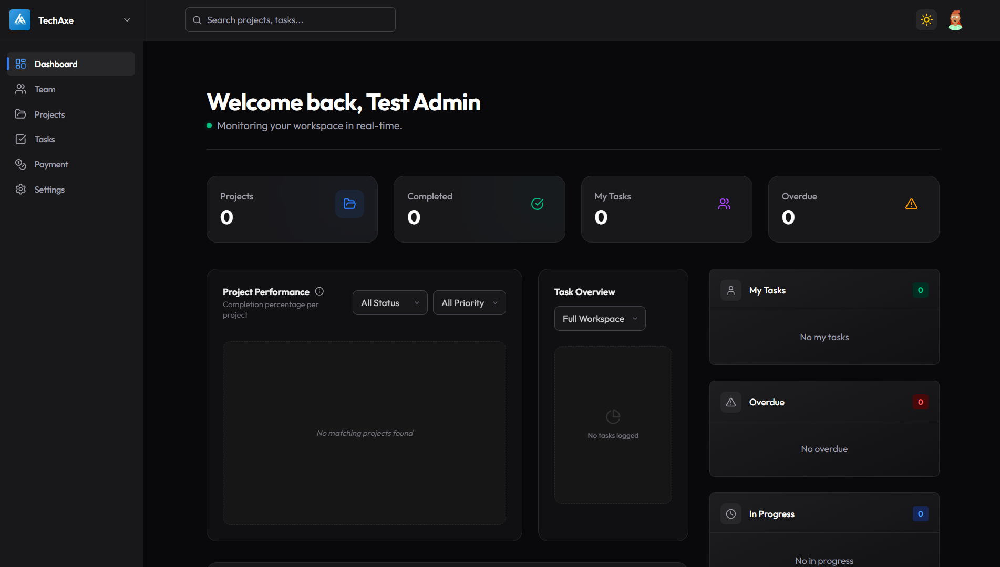

# TaskFlow

A full-stack project management and team collaboration SaaS application built with the MERN stack (MongoDB, Express.js, React, Node.js). TaskFlow helps teams organize projects, track tasks, manage workflows, and collaborate effectively.



## 🌟 Features

### Core Functionality

- **User Authentication & Authorization**
  - Email-based registration with role selection (Admin, Manager, Developer)
  - JWT token-based authentication
  - Email verification with OTP codes
  - Forgot password and reset functionality
  - Change password while logged in
  - Profile management with image upload

- **Workspace Management**
  - Create and manage multiple workspaces
  - Workspace invite codes for team joining
  - Role-based access control (Admin, Manager, Developer)
  - Member invitation and management
  - Workspace settings customization
  - Plan-based workspace limits

- **Project Management**
  - Create projects within workspaces
  - Multiple file attachments per project
  - Project member assignment
  - Project editing and deletion
  - Project visibility based on membership
  - Plan-based project limits

- **Task Management**
  - Create and assign tasks to team members
  - Task status tracking (To Do, In Progress, Completed)
  - Priority levels (High, Medium, Low)
  - Due date management
  - Task comments and discussions
  - Bulk task operations
  - Plan-based task limits

- **Team Collaboration**
  - Team member management
  - Role-based permissions
  - Workspace join via invite codes
  - Collaborative task management
  - Activity tracking

- **Dashboard & Analytics**
  - Statistics overview (projects, tasks, team members)
  - Performance charts and graphs
  - Recent activity feed
  - Project progress visualization
  - Task completion metrics

- **Payment Integration**
  - Stripe payment processing
  - Three subscription tiers: Free, Pro, Ultimate
  - Subscription management
  - Payment history tracking
  - Plan upgrade/downgrade functionality
  - Stripe webhook integration

---

## 🏗️ Tech Stack

### Frontend

- **React 19** - UI library
- **Vite** - Build tool and dev server
- **Zustand** - State management
- **React Router DOM** - Client-side routing
- **Tailwind CSS v4** - Utility-first styling
- **Framer Motion** - Animation library
- **Recharts** - Data visualization
- **Lucide React** - Icon library
- **Axios** - HTTP client
- **date-fns** - Date utilities
- **React Hot Toast** - Notifications

### Backend

- **Node.js** - Runtime environment
- **Express.js** - Web framework
- **MongoDB** - NoSQL database
- **Mongoose** - Object Document Modeling
- **JWT** - Authentication tokens
- **Bcryptjs** - Password hashing
- **Stripe** - Payment processing
- **Cloudinary** - File upload and storage
- **Nodemailer** - Email service
- **Node-cron** - Scheduled background jobs
- **Winston** - Logging utility
- **Express Validator** - Input validation
- **Multer** - File upload middleware
- **CORS** - Cross-origin resource sharing
- **Cookie Parser** - Cookie handling

### Testing & Development

- **Jest** - Test framework
- **Supertest** - HTTP assertion testing
- **MongoDB Memory Server** - In-memory database for testing
- **ESLint** - Code quality enforcement

---

## 📦 Project Structure

```
TaskFlow/
├── client/                 # React frontend application
│   ├── src/
│   │   ├── api/           # API integration layer
│   │   ├── components/    # Reusable UI components
│   │   ├── constants/     # App constants
│   │   ├── hooks/         # Custom React hooks
│   │   ├── layout/        # Layout components
│   │   ├── lib/           # Utility libraries
│   │   ├── pages/         # Page components
│   │   │   ├── auth/      # Authentication pages
│   │   │   └── portal/    # Main application portal
│   │   ├── store/         # Zustand state management
│   │   └── utils/         # Utility functions
│   ├── public/            # Static assets
│   ├── .env.example       # Environment variables template
│   └── package.json       # Frontend dependencies
│
├── server/                # Node.js backend application
│   ├── config/            # Configuration files (DB, Cloudinary, etc.)
│   ├── controllers/       # Route controllers
│   │   ├── auth.controller.js
│   │   ├── workspace.controller.js
│   │   ├── project.controller.js
│   │   ├── task.controller.js
│   │   └── payment.controller.js
│   ├── db/                # Database models
│   ├── jobs/              # Cron scheduled jobs
│   ├── lib/               # Core libraries
│   ├── middlewares/       # Express middlewares
│   │   ├── auth.middleware.js
│   │   ├── check_plan_limit.middleware.js
│   │   ├── rate_limiter.middleware.js
│   │   └── ...
│   ├── repositories/      # Data access layer
│   ├── routes/            # API routes
│   │   ├── auth.routes.js
│   │   ├── workspace.routes.js
│   │   └── payment.routes.js
│   ├── services/          # Business logic services
│   ├── tests/             # Test files
│   ├── utils/             # Utility functions
│   ├── views/             # EJS templates
│   ├── .env.example       # Environment variables template
│   └── package.json       # Backend dependencies
│
├── ERD.png                # Entity Relationship Diagram
├── README.md              # This file
├── API_Documentation.md   # Complete API reference
├── Features_List.md       # Detailed feature documentation
└── Setup_Installation.md  # Installation guide
```

---

## 🚀 Getting Started

### Prerequisites

Before you begin, ensure you have the following installed:

- **Node.js** (v20.x or higher) - [Download](https://nodejs.org/)
- **MongoDB** (v6.0+) - [Download](https://www.mongodb.com/try/download/community) or use [MongoDB Atlas](https://www.mongodb.com/cloud/atlas)
- **npm** or **yarn** package manager

### Quick Start

#### 1. Clone the Repository

```bash
git clone <repository-url>
cd TaskFlow
```

#### 2. Install Dependencies

```bash
# Install root dependencies
npm install

# Install server dependencies
cd server
npm install

# Install client dependencies
cd ../client
npm install
```

#### 3. Environment Configuration

**Server (.env in `/server`)**

```env
NODE_ENV=development
PORT=3000
MONGODB_URI=mongodb://localhost:27017/taskflow
CLIENT_URL=http://localhost:5173
JWT_ACCESS_TOKEN_SECRET=your-secret-key
JWT_ACCESS_TOKEN_EXPIRY=7d
NODEMAILER_EMAIL_SERVICE=gmail
NODEMAILER_EMAIL=your-email@gmail.com
NODEMAILER_PASSWORD=your-app-password
NODEMAILER_EMAIL_FROM=your-email@gmail.com
CLOUDINARY_CLOUD_NAME=your-cloud-name
CLOUDINARY_API_KEY=your-api-key
CLOUDINARY_API_SECRET=your-api-secret
STRIPE_SECRET_KEY=sk_test_your-secret-key
STRIPE_WEBHOOK_SECRET=whsec_your-webhook-secret
STRIPE_FREE_PRICE_ID=price_free-id
STRIPE_PRO_PRICE_ID=price_pro-id
STRIPE_ULTIMATE_PRICE_ID=price_ultimate-id
```

**Client (.env in `/client`)**

```env
NODE_ENV=development
VITE_API_BASE_URL=http://localhost:3000/api
VITE_STRIPE_PUBLISHABLE_KEY=pk_test_your-publishable-key
```

#### 4. Run the Application

**Terminal 1 - Backend:**

```bash
cd server
npm run dev
```

**Terminal 2 - Frontend:**

```bash
cd client
npm run dev
```

The application will be available at:

- Frontend: http://localhost:5173
- Backend API: http://localhost:3000

For detailed installation instructions, see [Setup_Installation.md](./documentation/Setup_Installation.md)

---

## 📖 API Endpoints

### Authentication

- `POST /api/auth/register` - Register new user
- `POST /api/auth/varify-email` - Verify email with OTP
- `POST /api/auth/forgot-password` - Request password reset
- `POST /api/auth/reset-password/:token` - Reset password
- `POST /api/auth/log-in` - User login
- `POST /api/auth/log-out` - Logout user
- `GET /api/auth/profile` - Get user profile
- `GET /api/auth/check-auth` - Check authentication status
- `PUT /api/auth/update-profile` - Update profile
- `PUT /api/auth/change-password` - Change password

### Workspaces

- `GET /api/workspace` - Get all workspaces
- `POST /api/workspace/create` - Create workspace
- `POST /api/workspace/join/:invite_code` - Join workspace
- `GET /api/workspace/:workspaceId/members` - Get members
- `POST /api/workspace/:workspaceId/invite` - Invite member
- `PATCH /api/workspace/:workspaceId/members/:memberId/role` - Update role
- `DELETE /api/workspace/:workspaceId/members/:memberId` - Remove member
- `PUT /api/workspace/:workspaceId/settings` - Update settings
- `DELETE /api/workspace/:workspaceId` - Delete workspace

### Projects

- `POST /api/workspace/:workspaceId/projects` - Create project
- `PUT /api/workspace/:workspaceId/projects/:projectId` - Update project
- `DELETE /api/workspace/:workspaceId/projects/:projectId` - Delete project
- `POST /api/workspace/:workspaceId/projects/:projectId/members` - Add member
- `DELETE /api/workspace/:workspaceId/projects/:projectId/members/:memberId` - Remove member

### Tasks

- `POST /api/workspace/:workspaceId/projects/:projectId/tasks` - Create task
- `GET /api/workspace/:workspaceId/projects/:projectId/tasks` - Get tasks
- `PATCH /api/workspace/:workspaceId/projects/:projectId/tasks/:taskId` - Update task
- `PATCH /api/workspace/:workspaceId/projects/:projectId/tasks/:taskId/status` - Update status
- `PATCH /api/workspace/:workspaceId/projects/:projectId/tasks/:taskId/assignees` - Update assignees
- `DELETE /api/workspace/:workspaceId/projects/:projectId/tasks` - Delete tasks
- `GET /api/tasks/:taskId/comments` - Get comments
- `POST /api/tasks/:taskId/comments` - Add comment

### Payments

- `GET /api/payment/plans` - Get subscription plans
- `GET /api/payment/:userId/subscription` - Get subscription
- `GET /api/payment/:userId/history` - Get payment history
- `POST /api/payment/checkout` - Create checkout session
- `DELETE /api/payment/:userId/subscription` - Cancel subscription
- `DELETE /api/payment/:userId/downgrade` - Downgrade to free
- `POST /api/payment/webhook` - Stripe webhook handler

For complete API documentation with examples, see [API_Documentation.md](./documentation/API_Documentation.md)

---

## 💳 Subscription Plans

### Free Plan ($0/month)

- 1 Workspace
- Up to 3 Team Members
- 1 Project per workspace
- 3 Tasks per project

### Pro Plan ($19/month)

- 5 Workspaces
- Up to 10 Team Members
- 10 Projects per workspace
- 10 Tasks per project

### Ultimate Plan ($49/month)

- Unlimited Workspaces
- Unlimited Team Members
- Unlimited Projects
- Unlimited Tasks

---

## 🛠️ Available Scripts

### Root Directory

```bash
npm run build    # Install dependencies and build client
npm start        # Start production server
```

### Backend (server/)

```bash
npm start        # Start production server
npm run dev      # Start development server with auto-reload
npm test         # Run test suite
```

### Frontend (client/)

```bash
npm run dev      # Start development server
npm run build    # Build for production
```

---

## 🧪 Running Tests

```bash
cd server
npm test
```

Tests cover:

- Authentication endpoints
- Workspace CRUD operations
- Project management
- Task management
- Payment processing

---

## 🔒 Security Features

- **JWT Authentication**: Secure token-based authentication
- **Password Hashing**: Bcryptjs with salt rounds
- **Email Verification**: Mandatory OTP verification
- **Rate Limiting**: Protection against brute force attacks
- **Input Validation**: Express-validator for request sanitization
- **CORS Protection**: Configured cross-origin policies
- **Role-Based Access Control**: Permission enforcement at route level
- **Plan Limit Enforcement**: Resource limits based on subscription tier

---

## 🎨 UI/UX Features

- **Responsive Design**: Mobile-first approach
- **Dark Mode**: System preference detection and manual toggle
- **Smooth Animations**: Framer Motion transitions
- **Toast Notifications**: Real-time user feedback
- **Loading States**: Skeleton screens and spinners
- **Error Handling**: User-friendly error messages
- **Protected Routes**: Authentication guards

---

## 🔧 Configuration

### Database

- MongoDB connection with connection pooling
- Automatic reconnection on failure
- Support for both local and cloud (Atlas) databases

### File Upload

- Multer middleware for handling uploads
- Cloudinary integration for cloud storage
- Support for multiple file types
- File size and type validation

### Email Service

- Nodemailer configuration
- Gmail SMTP support
- Custom SMTP support
- HTML email templates

### Payment Processing

- Stripe SDK integration
- Test mode for development
- Webhook handling for events
- Subscription lifecycle management

---

## 📝 Environment Variables

All required environment variables are documented in:

- `server/.env.example` - Backend configuration
- `client/.env.example` - Frontend configuration

See [Setup_Installation.md](./documentation/Setup_Installation.md) for detailed explanations.

---

## 🐛 Troubleshooting

Common issues and solutions are covered in [Setup_Installation.md](./documentation/Setup_Installation.md), including:

- MongoDB connection errors
- Port conflicts
- CORS issues
- Email delivery problems
- Stripe integration issues
- Cloudinary upload errors

---

## 📚 Documentation

- **[README.md](./documentation/README.md)** - Project overview (this file)
- **[API_Documentation.md](./documentation/API_Documentation.md)** - Complete API reference with examples
- **[Features_List.md](./documentation/Features_List.md)** - Comprehensive feature documentation
- **[Setup_Installation.md](./documentation/Setup_Installation.md)** - Detailed installation guide
